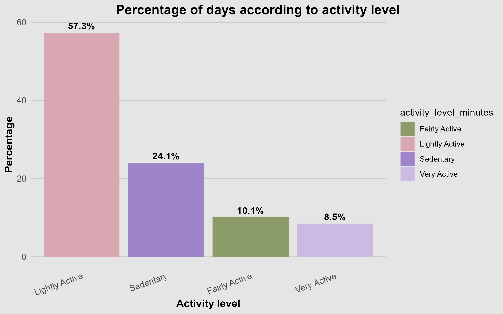

# Bellabeat-case-study
Final project for the Google Data Analytics Professional Certificate. In this case study, I analyze smart device usage data to identify behavior patterns and generate actionable marketing recommendations for Bellabeat, a health-tech company focused on women's wellness.

# Bellabeat Case Study: Data Analysis for a Marketing Strategy

## Introducción
Bellabeat wants to understand how women use health-tracking devices and how this behavior can inform the design, messaging, and features of their smart products. The ultimate goal is to improve user engagement, drive adoption, and strengthen their position in the wellness technology market.
**Stakeholders**
**Urška Sršen:** Co-founder and Creative Director of Bellabeat.
**Sando Mur:** Co-founder and key mathematician on the executive team.
**Equipo de Marketing de Bellabeat:** Responsible for the marketing strategy.

### Data source
The data comes from the Fitbit Fitness Tracker dataset. It includes 30 users' daily activity, steps, sleep, and intensity data collected over 31 days.

### ROCCC Analysis
The data is stored on Kaggle, from the FITBIT FITNESS TRACKER DATA dataset.
ROCCC
**Reliable:** Low – Small sample size (30 users), not representative
**Original:** Low – Third-party data collected via Amazon Mechanical Turk
**Complete:** Medium – Lacks demographic data (age, location)
**Consistent:** Low – From 2016, trends may be outdated
**Cited:** High – Documented and verifiable

Despite limitations, the dataset is valid for practicing analytical thinking and exploring general user behavior patterns.

### Tools Used

**R/RStudio (Excel):** Data wrangling, visualization, and analysis.
**Tidyverse:** Data cleaning and transformation
**ggplot2:** Visualizations
**GitHub:** Project documentation and version control

### Process
Data cleaning steps:
-Removed duplicates and NAs
-Standardized datetime formats
-Joined relevant tables (e.g. dailyActivity, sleepDay)
-Created new variables (e.g. hourly averages, correlation metrics)
See full code in bellabeat_analysis.R
* [**R Script**](code/bellabeat_analysis.R)

### Analyze

#### Finding 1: Most activity happens between 12:00 PM and 7:00 PM
Users tend to be most active in the afternoon, suggesting ideal windows for app notifications or encouragement.

#### Finding 2: 62% of users showed an improvement in their daily activity throughout the month.
A majority of users showed positive behavioral change across the month. This supports Bellabeat positioning as a tool for long-term motivation.

#### Finding 3: Weak correlation between steps and sleep for most users
Only 2 users showed a strong positive correlation. Sleep and physical activity may not be directly linked for all, suggesting the need for personalized recommendations.

#### Finding 4: Most users are sedentary or lightly active
-57.3% of days: "Lightly Active"
-24.1%: "Sedentary"

This shows an opportunity to promote gentle, approachable routines.

#### Finding 5: More activity ≠ more sleep
Lightly Active: 7.3 hrs
Sedentary: 6.9 hrs
Very Active: 6.4 hrs

Those who are moderately active sleep more, indicating a possible “sweet spot” for wellness.

#### Finding 6: Inconsistent tracking among users

Several users skipped days without logging steps or sleep. This points to a need for engagement strategies to improve consistency.

### Share
**Visualizations Used**
Line plots (steps per hour)
Multi-user time series (step evolution)
Correlation category bar plot
Stacked bar (activity levels)
Bar plot (sleep by activity level)

### Fase 6: Actuar (Act)

Based on the findings, here are my recommendations for Bellabeat's marketing strategy:

**Recommendation 1:** Create an experience that encourages consistency through smart notifications and challenges.

**Problem (insight):** I discovered that many users don't use their device daily. If a user doesn't develop the habit of using it, they're likely to abandon it.

**Solution (Suggestion):** 

*Timely notifications:* Send reminders and motivational messages through the Bellabeat app during times when users are typically most     active (between 12 and     7 p.m.). A message like "It's a great time to go for a walk and reach your step goal!" can motivate the user.

*Fun challenges:* Create monthly challenges within the app (e.g., "10,000 steps a day challenge") with virtual rewards like medals or badges. This is seen as        fun, encourages friendly competition, and encourages users to return to using the device daily.

**Benefit:** It will increase daily device usage, strengthen the habit, and, as a result, improve long-term customer loyalty.
   
**Recommendation 2:** Focus marketing on "balanced wellness," not just physical performance.

**Problem (Insight):** Data shows that physical activity is only one part of health; sleep and rest are equally important. Focusing only on "burning calories" or "being the most athletic" can bore many women, as some people genuinely dislike exercising at all.

**Solution (Suggestion):** Position Bellabeat as a tool for finding balance in life. Instead of aggressive performance marketing, create campaigns that talk about how small changes in daily activity can improve sleep quality, reduce stress, and increase energy. Some messages would be: *"Bellabeat helps you take care of yourself by finding your own rhythm."* o *"Exercise and mental health: always connected."*

**Benefit:** Attract a broader audience of women looking for overall wellness, not just a high-performance fitness tracker. This differentiates Bellabeat from the competition and creates a stronger emotional connection with its brand.

**Recommendation 3:** Offer customization so each user feels unique.

**Problem (Insight):** Every user is different. A "one-size-fits-all" plan doesn't work and can be demotivating. As seen above, the data shows variations in activity levels and sleep patterns between individuals.

**Solution (Suggestion):** Use the data the Bellabeat app already collects to offer personalized advice. For example:
If a user sleeps little but walks a lot, the app could suggest: 
*"We noticed you're very active. Did you know that 15 minutes of relaxation before bed could help you rest better so you'll have even more energy tomorrow?"* 
or *"We noticed you're very active. Avoid stimulants like caffeine in the afternoon and evening, so you'll have a restful sleep."* or *"Make sure your room is completely dark and quiet, so you'll sleep soundly."*

If you can't sleep, create an interface in the app where you can see information suggesting activities to help you fall asleep. This way, you can avoid sending too many notifications, as this could be harassing to the user.

For a user with low activity, the app could celebrate small achievements: *"Congratulations! Today you took 500 more steps than yesterday. Keep it up!"* or *"You had an exceptional day today. If you manage to take 1,000 steps tomorrow, you'll get a badge."*

**Benefit:** It makes the user feel that Bellabeat truly understands and supports them. This personalization dramatically increases the perceived value of the product and fosters deep brand loyalt

